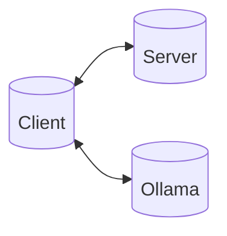

# MCP

This is a project where I tried to learn more about the Model Context Protocol



## Client

The client I am using is [ollmcp](https://github.com/jonigl/mcp-client-for-ollama), 
I chose it because it is simple and supports local models. Also my main focus is
the server side, using this tool gives me a complete client with very little effort.

## Server

For the server I am using th [rmcp](https://github.com/modelcontextprotocol/rust-sdk) crate.
I chose it because I am trying to learn more Rust, and it should be fast.

## LLM

The project uses [ollama](https://hub.docker.com/r/ollama/ollama) to run dockerized local models.

## Usage

```bash
# Run this once to download the ollama docker image and star a container.
# If you want support for Nvidia refer the the Docker image page.
make ollama_docker_cpu # or ollama_docker_amd for AMD GPU.

# Start a model in the container
make ollama_run_model MODEL=qwen3:8b # qwen3:8b is the default model.

# Start the server
# Do this in a separat terminal window
make run_server

# Start the client
make run_client
```

Once everything is up and running try something like "hey can you increase the count please?"
and the client should suggest executing the localhost_8000.increase tool.
